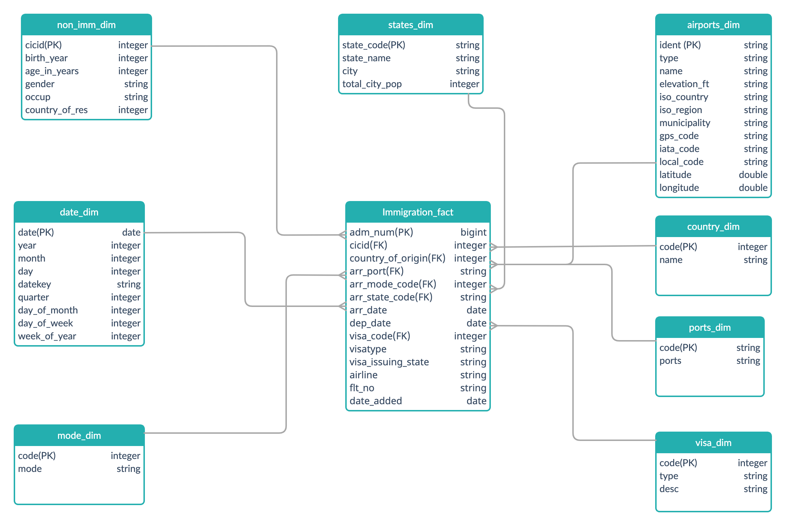
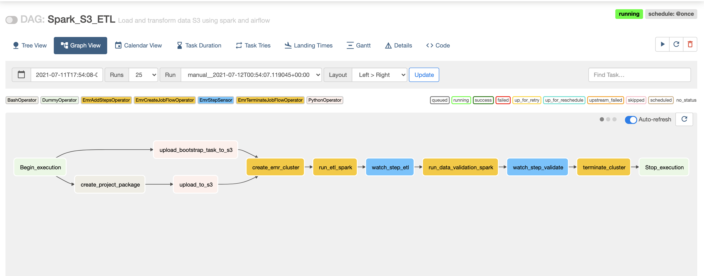
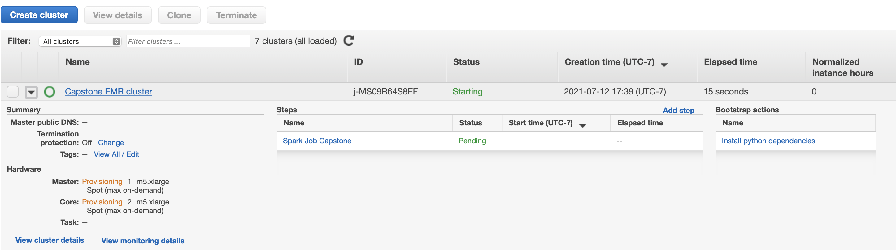
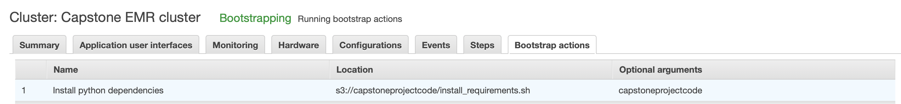
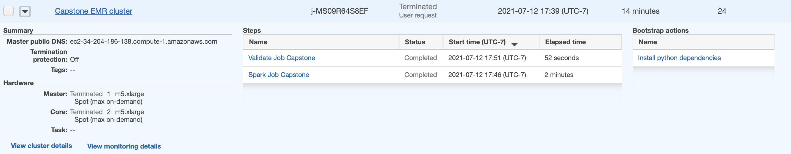
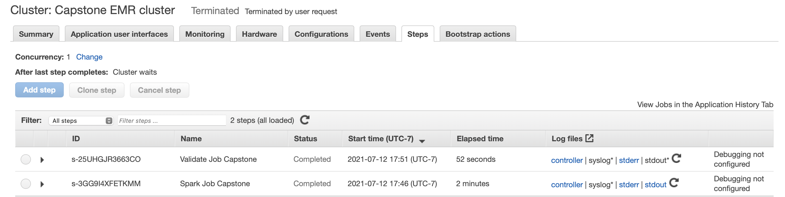

## Purpose
The purpose of this project is to create a dataset to ease query for jobs. For that we don't need normalized schema, instead star schema is created because of it's scalability in terms of reading and querying. This star schema can be further modified to create more summarized data such as OLAP cubes for BI and analytics.

## Scope 
The scope of this project is to analyze the raw data for immigration, airlines, states provided/gathered from the sources mentioned below. Transform and clean the data to load into a schema in s3. 

### Describe and Gather Data 
##### I94 Immigration Data: 
This data comes from the [US National Tourism and Trade Office](https://www.trade.gov/national-travel-and-tourism-office).
The data is provided in both sas and parquet format. We would be using parquet format for this project. This data contains event information related to immigrants. Their entry date, visa, mode of entry, country of origin/residence, their return date, airlines, modes of travel etc. All the event related information is provided in the data files and are already stored in s3.<br><br>
##### U.S. City Demographic Data: 
This data comes from [OpenSoft](https://public.opendatasoft.com/explore/dataset/us-cities-demographics/export/), file is delimited by semicolon contains information related to city, state, male/female population, racial population and other demographic information. <br><br>
##### Airport Code Table: 
This is a simple table of airport codes and corresponding cities. It comes from [datahub.io](https://datahub.io/core/airport-codes#data). Data is stored in CSV format.<br><br>
##### Other Data Sources:
Following data sources are coming from I94_SAS_Labels_Descriptions.SAS file transformed into CSV<br>
- Countries : Contains country code and name
- States : Contains state code and name
- Visa : Contain Visa code and type
- Mode : Contains mode code and mode name
- Ports : Contains port code and port name/state


### Conceptual Data Model
This section will provide an overview of the data design for this specific project and how it is going to be modeled.

To simplify the schema we'll have only a single fact table. Here are the dimensions that are identified from the immigration data:
- Visa
- Mode of travel
- List of Countries
- Port of entry:
	- Ports
	- Airports 
- States
- Immigrant
- Date

Dataset that has log of each entry and exit of a non-immigrant (source for fact table):
- I94 Data

Following diagram shows the relationship amoung dimensions and fact, along with their respective primary and foreign keys.




### Using Spark with AWS EMR and S3:

This pipeline will use spark to model the data into data model above. The source files are placed in s3 bucket (parquet format) and to be transformed into star schema using Spark and EMR clusters. <br>

Since we are dealing with millions of records here and reading the data from data files, spark was a clear choice here as it support wide range of data formats and also the in memory processing is much faster. With pyspark it's easy to use dataframe APIs for processing large chunk of structured or semi-structured data.<br><br>
With spark we just need the cluster for it's processing power and for that EMR was an obvious choice. EMR clusters are easy to setup, can scale up and down depending on the workload and it has very good integration with APACHE AIRFLOW which is used as orchestrator for this project.<br><br>
S3 is used for creating schema on read. It's setup is straightforward and easily accessible from EMR clusters.<br>

AWS Cluster :
- Cluster : EMR (m5.xlarge) <br>
- Number of nodes : 3 (1 master, 2 slaves)  <br>


SPARK : 
Spark 2.4.7 on Hadoop 2.10.1 YARN
<br><br>
**SETUP AWS** 

To use s3 and EMR, create `IAM user` on AWS and save the one time generated access id and access key which will be used in all the aws connections. 

Also create `EC2 key pair` and save the .pem file, this file can be used to SSH to EMR clusters from local machine or to slave nodes from master node.

`Aws cli` needs to be setup to run any command from local machine. Profile should be created and credentials should be set in `~/.aws/credentials`.

Following command would create the EMR cluster from command line. Please note that there are multiple ways to connect to AWS and perform tasks. For instance Airflow EMR OPERATORS are also a great choice to create cluster and run spark jobs.


**AWS CLI**

```
    aws emr create-cluster \
    --name spark-project \
    --use-default-roles \
    --release-label emr-5.20.0  \
    --instance-count 3 \
    --applications Name=Spark Name=JupyterHub Name=Hadoop  \
    --ec2-attributes KeyName=spark-cluster \
    --instance-type m5.xlarge \
    --profile project-aws
```


**AIRFLOW EMR OPERATOR**
 
```
    emr_create_config = {
        "Name": "Capstone EMR cluster",
        "ReleaseLabel": "emr-5.33.0",
        "LogUri": "s3://{{params.BUCKET_NAME}}/logs",
        "Applications": [{"Name": "Hadoop"}, {"Name": "Spark"}, {"Name": "JupyterHub"}],
        "Configurations": [
            {
                "Classification": "spark-env",
                "Configurations": [
                    {
                        "Classification": "export",
                        "Properties": {"PYSPARK_PYTHON": "/usr/bin/python3"},
                    }
                ],
            }
        ],
        "Instances": {
            "InstanceGroups": [
                {
                    "Name": "Master node",
                    "Market": "SPOT",
                    "InstanceRole": "MASTER",
                    "InstanceType": "m5.xlarge",
                    "InstanceCount": 1,
                },
                {
                    "Name": "Slave node",
                    "Market": "SPOT",
                    "InstanceRole": "CORE",
                    "InstanceType": "m5.xlarge",
                    "InstanceCount": 2,
                },
            ],
            "KeepJobFlowAliveWhenNoSteps": True,
            "TerminationProtected": False,
            "Ec2KeyName": "{{params.KEY_NAME}}",
        },
        "BootstrapActions" : [
            {
                "Name": "Install python dependencies",
                "ScriptBootstrapAction" :
                    {
                        "Args": ["{{params.BUCKET_NAME}}"],
                        "Path": "s3://{{params.BUCKET_NAME}}/{{params.BOOTSTRAP_RUN}}"
                    },
            }
        ],
        "JobFlowRole": "EMR_EC2_DefaultRole",
        "ServiceRole": "EMR_DefaultRole",
        "VisibleToAllUsers": True
    }


    create_emr_cluster = EmrCreateJobFlowOperator(
        task_id="create_emr_cluster",
        job_flow_overrides=emr_create_config,
        aws_conn_id="aws_credentials",
        emr_conn_id="emr_default",
        params={
                "BUCKET_NAME": bucket_name,
                "BOOTSTRAP_RUN": bootstrap_script,
                "KEY_NAME": ec2_key_name
                },
    )

```

The airflow job  also runs a boostrap script `install_requirements.sh` that install the python dependencies on EMR cluster

    --bootstrap-actions Path="s3://capstoneprojectcode/install_requirements.sh"
    
To avoid any extra costs of running the EMR cluster, spark-submit can be added as step after create cluster command is issued, these steps are orchestrated by AIRFLOW in this project to minimize the cluster UP time.

**AWS CLI**

```
aws emr add-steps --cluster-id <cluster-id> --steps Type=spark,Name=<StepNAme>,Args=[--deploy-mode,client,main.py], ActionOnFailure=CONTINUE

```

**AIRFLOW EMR OPERATOR**

```

    spark_step = [
        {
            "Name": "Spark Job Capstone",
            "ActionOnFailure": "CANCEL_AND_WAIT",
            "HadoopJarStep": {
                "Jar": "command-runner.jar",
                "Args": [
                    "spark-submit",
                    "--deploy-mode",
                    "{{params.DEPLOY_MODE}}",
                    "{{params.ETL_SCRIPT}}",
                ],
            },
        },
    ]

    run_etl_spark = EmrAddStepsOperator(
        task_id="run_etl_spark",
        job_flow_id="{{ task_instance.xcom_pull(task_ids='create_emr_cluster', "
                    "key='return_value') }}",
        aws_conn_id="aws_credentials",
        steps=spark_step,
        params={"DEPLOY_MODE": deploy_mode,
                "ETL_SCRIPT": spark_etl
                },
    )
```
### AIRFLOW

The steps to run create_cluster, ETL and data validation can be orchestrated in AIRFLOW and before configuring DAGs to run the pipeline the airflow needs to be set up locally.
This can be done by downloading the docker from [here](https://docs.docker.com/get-docker/) and airflow docker-compose.yaml from [here](https://airflow.apache.org/docs/apache-airflow/2.1.1/docker-compose.yaml)

Create the home directory for airflow project and create `./dag ./plugins ./logs` inside the project directory. `docker-compose.yaml` should be in the project directory.

Next run `docker-compose up airflow-init` to configure the airflow in local

Bring airflow up by running `docker-compose up` or `docker-compose up -d (detached mode)` inside the airflow project directory. This should bring up airflow UI on `localhost:8080`

Bring the services down by running `docker-compose down`

Following connections to be configured in airflow to connect to AWS

Conn Id| Conn Type | fields |
-------|-----------|---------|
aws_credentials|  Amazon Web Services | Access Id, Secret Acccess Token, Specify Region in Extra textbox|
emr_default    | Elastic MapReduce    | No additional field required to create the cluster and run the steps. Extra field can be used to store create-cluster json


#### AIRFLOW DAG:


**upload_bootstrap_task_to_s3** :  Shell script to be uploaded in s3 which runs during the creation of EMR cluster which setup the project workspace and also install any requirements/dependencies for python modules to load and run properly.

**create_project_package** : Bash command to package the project into a tar file.

**upload_to_s3** :  Upload the project tar to s3 which is used by the bootstrap script to setup project space on EMR. Though zip files can be accessed from s3 directly while issuing spark-submit but this step ensures there are no import errors when the spark runs.

**run_etl_spark** : Invokes etl.py from project /scripts directory which includes following steps:
1) Creates spark session 
2) Extract the data from s3 into spark data frames
3) Clean and transform the data into dim and fact tables
4) Load the data back in s3 in parquet format, creating a schema on read

**watch_step_etl** : This step ensures the validation wont's run until the output is uploaded in s3.

**run_data_validation_spark** : This steps performs validation on the output schema/tables.

**watch_step_validate** : This step ensures the cluster won’t terminate until spark job is completed.
 
**terminate_cluster** : Issue terminate cluster when the spark job is completed.




<br><br>
Screenshots from AWS, pipeline initiates creation of EMR cluster and runs the steps before terminating the cluster.






<br><br>
Steps Completed, cluster terminated




<br><br>
Spark logs are automatically saved in s3 bucket, this is taken care by specifying LogUri when the cluster created.



<br>

### Project Structure:

Data pipeline is triggered externally for now since this is just a sample project to show the creation of ETL end to end.
Here is what project structure looks like :

1) **CapstoneProject/** : contains ETL code in python
    - scripts/ : etl code to read, tramsform, write in s3, also validation code
    - conf/ : contains config file
    - main.py : invokes etl process
    - validator.py : invokes data validator post etl is complete
2) **dags/** : contains airflow dags
3) **logs/** : contains airflow workflow logs
4) **plugins/** : contains airflow helpers and operators, we did not create any custom operators for this project though


