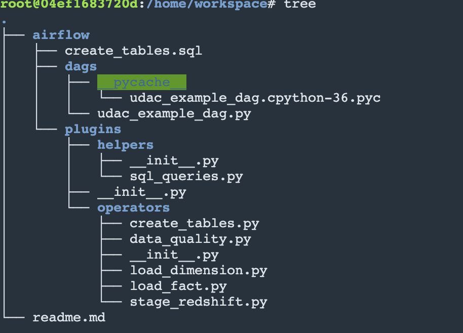
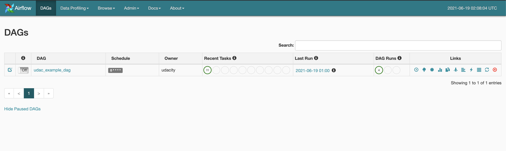
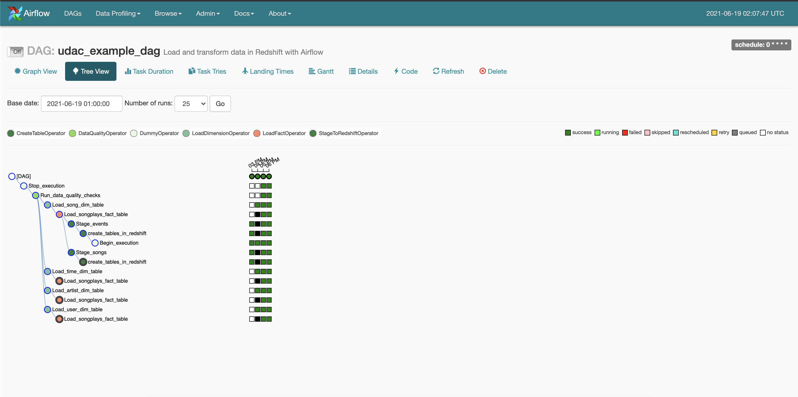
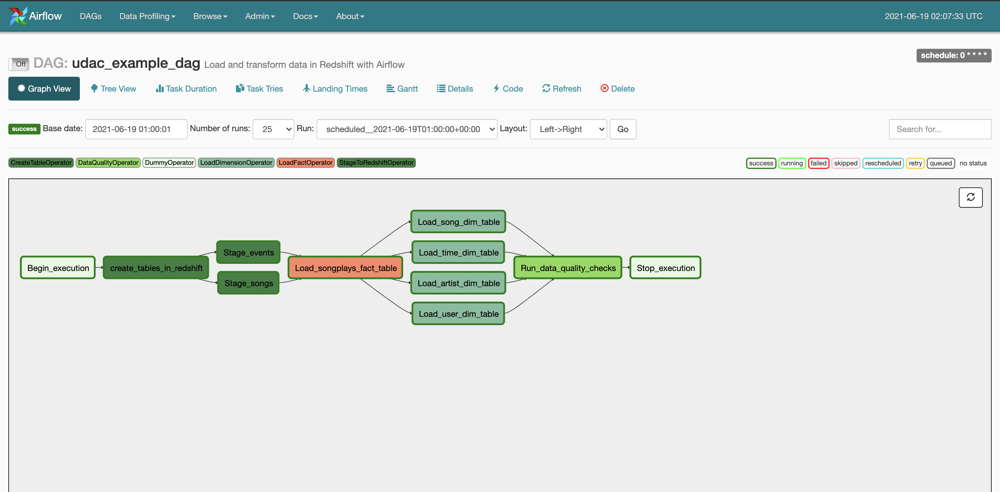

<h4>PROJECT : DATA PIPELINES WITH AIRFLOW</h4>
Sparkify’s analytical team wants to analyze the data collected on songs and user activity on their new streaming app. They want to analyze what songs users are listening to. The user activity logs and song metadata is available to analyze for this specific use case.    
The data is available in JSON format on S3 buckets, needs to be transformed using apache airflow dags to be further structured and put into respective facts and dimension tables in redshift. ETL pipeline to be created to carry out the transformation. The project will use AWS, python, sql, apache airflow to create the pipeline.  

<h5>DataSets</h5> 
- Song Dataset:  Resides in s3://udacity-dend/song_data. Data files are in Json format and contains metadata about song and the artist of the song.  The files are partitioned by the first three letters of each song's track ID. 
- Log Dataset: Resides in s3://udacity-dend/log_data. Data files are in Json format and contains user activity.  The files are partitioned by partitioned by year and month  

<h5>AWS Redshift Cluster</h5> 
AWS Redshift is used in ETL pipeline  
- Cluster : dc2.large nodes  
- Number of nodes : 4   

<h5>Schema</h5>
- The star schema will consists of following tables:

<h5>Staging Tables</h5>
1. staging_events : Data dump from log dataset  
    - attributes : artist, auth, firstname, gender, iteminsession, lastname, length, level, location, method, page, registration, sessionid, song, status, ts, useragent, userid  
2. staging_songs : Data dump from song dataset  
    - attributes : num_songs, artist_id, artist_latitude, artist_longitude, artist_location, artist_name, song_id, title, duration, year
 
<h5>Fact Table</h5>
1. songsplay: log data associated with song play 
   - attributes:  songplay_id, start_time, user_id, level, song_id, artist_id, session_id, location, user_agent 

<h5>Dimension Tables:</h5>
1. users: list of users  
   - attributes : user_id, first_name, last_name, gender, level  
2. songs: songs in database  
   - attributes : song_id, title, artist_id, year, duration*  
3. artists: artist in database  
   - attributes: artist_id, name, location, latitude longitude*  
4. time: timestamp broken down to specific units  
   - attributes: start_time, hour, day, week, month, year, weekday*   

<h5>Project Design:</h5>

The log data from songs and user activity is analyzed and tables are designed  to ensure the queries to  analyze the user activities gets the data from database in optimal time. 

Project Structure:

1. dags: This directory contains the python files that define the workflow
    - udac_example_dag.py: Script that has the tasks and workflow for the ETL pipepline.   

2. plugins: 
    1. helpers: This directory contains the helper sql queries 
        - sql_queries.py : sqls to populate fact and dimension tables 
    2. operators: This directory contains the use defined operators 
        - create_tables.py : Defines "CreateTableOperator" to help create the tables in redshift
        - data_quality.py : Defines "DataQualityOperator" to help check the quality of the data after the tables are populated in star schema
        - load_dimension.py: Defines "LoadDimensionOperator" to help load the data from staging to dimension tables
        - load_fact.py: Defines "LoadFactOperator" to help load the data from staging to fact table
        - stage_redshift: Defines "StageToRedshiftOperator" to help load data from S3 to staging tables.  

3. create_tables.sql : Script that contains SQL commands to DROP and CREATE the tables in star schema (staging, fact and dimension tables mentioned above)  

<h5>Airflow Pipeline:<h5>

